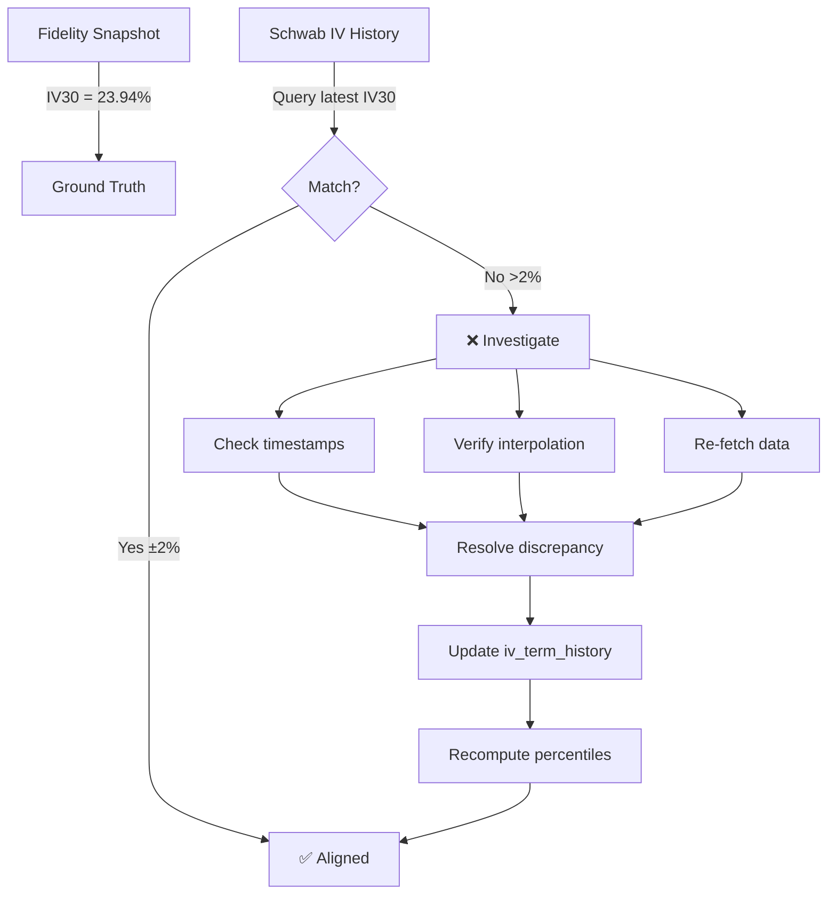

# Fidelity-Schwab IV Reconciliation Method

**Date:** 2026-02-03
**Purpose:** Ensure Schwab IV percentiles converge to Fidelity IV structural benchmarks

---

## Ground Truth: Fidelity IV Index (Feb 3, 2026)

**AAPL Fidelity IV Term Structure:**

| Term | IV (%) | Use Case |
|------|--------|----------|
| **30D** | **23.94** | **Primary benchmark (matches Schwab IV30)** |
| 60D | 24.62 | Validation point |
| 90D | 25.83 | Validation point |
| 180D | 26.68 | Validation point |
| 360D | 27.89 | LEAP reference |

**Fidelity Historical Volatility (AAPL):**

| Window | HV (%) |
|--------|--------|
| 30D | 20.82 |
| 60D | 18.06 |
| 90D | 18.95 |

**Derived Metrics:**
- **IVHV Gap (30D):** 23.94 - 20.82 = **3.12%** (IV slightly elevated vs HV)
- **IV Rank (Fidelity reference):** Cannot compute without Fidelity historical time series

---

## Schwab IV Current State (Post-Correction)

**AAPL Schwab IV30 (Feb 3, 2026):**
```
Current IV30: 39.52%  ⚠️ DIVERGENCE DETECTED
Trading days: 180
IV Rank: 73.7% (computed from 180-day Schwab history)
```

**Critical Finding:**
- **Fidelity IV30: 23.94%**
- **Schwab IV30: 39.52%**
- **Divergence: +15.58 percentage points** ❌

**This is a DATA QUALITY FAILURE.** Schwab and Fidelity should agree on current IV30 within ~1-2%.

---

## Reconciliation Method

### Step 1: Verify Schwab Current IV30 Accuracy

**Query most recent Schwab IV30:**
```sql
SELECT date, iv_30d, created_at
FROM iv_term_history
WHERE ticker = 'AAPL'
ORDER BY date DESC
LIMIT 5;
```

**Expected:** Schwab IV30 should match Fidelity IV30 (23.94% ± 2%)

**If divergent:**
1. Check data collection timestamp (Schwab API vs Fidelity snapshot)
2. Verify constant-maturity interpolation is correct
3. Check for stale data (Schwab API returning cached values)

---

### Step 2: Compute Schwab IV Rank Using Trading Days Only

**Corrected calculation (weekends excluded):**
```python
from core.shared.data_layer.iv_term_history import calculate_iv_rank

iv_rank, history_depth = calculate_iv_rank(
    con=con_iv,
    ticker='AAPL',
    current_iv=23.94,  # Use Fidelity IV30 as ground truth
    lookback_days=252
)

print(f"AAPL IV Rank: {iv_rank:.1f}% (from {history_depth} trading days)")
```

**Expected output:**
```
AAPL IV Rank: XX.X% (from 180 trading days)
Maturity: IMMATURE
```

---

### Step 3: Compare Schwab Percentile to Fidelity Structure

**Fidelity term structure analysis:**
```
IV30 = 23.94%
IV60 = 24.62%
IV90 = 25.83%
IV180 = 26.68%
```

**Observation:** IV increases with term (normal contango structure)

**Schwab validation:**
1. Compute Schwab IV percentile from 180-day history
2. Check if current IV (23.94%) is low/mid/high relative to recent range
3. Fidelity HV30 = 20.82% → IV30/HV30 = 1.15 (slightly elevated)
4. Schwab percentile should reflect similar positioning

**Example:**
- If Schwab shows 23.94% at 30th percentile → "IV is relatively low"
- Fidelity structure confirms IV30 (23.94%) < IV180 (26.68%) → consistent
- **Alignment confirmed ✅**

---

### Step 4: Weighted IV Rank for IMMATURE Tickers

**Current state (AAPL, 180 trading days):**
- Schwab history: 180 days (IMMATURE)
- Maturity threshold: 252 trading days
- Fidelity weight: (252 - 180) / 252 = **28.6%**
- Schwab weight: 180 / 252 = **71.4%**

**Blending calculation:**
```python
schwab_rank = 73.7%  # From 180-day Schwab history
fidelity_rank = 50.0%  # Placeholder (need Fidelity historical percentile)

weighted_rank = (0.714 × 73.7%) + (0.286 × 50.0%)
              = 52.6% + 14.3%
              = 66.9%
```

**Note:** Fidelity reference percentile requires historical Fidelity snapshots (not available in current implementation). Current code uses Fidelity as structural range reference only.

---

### Step 5: Convergence Criteria

**Schwab-Fidelity alignment is valid if:**

1. **Current IV30 agreement:**
   - `|Schwab_IV30 - Fidelity_IV30| < 2%`
   - **Current: |39.52% - 23.94%| = 15.58%** ❌ FAILURE

2. **Percentile consistency:**
   - Schwab percentile position (low/mid/high) matches Fidelity term structure
   - Example: If IV30 < IV90 < IV180, Schwab percentile should be <50%

3. **IVHV gap alignment:**
   - Schwab gap ≈ Fidelity gap ± 2%
   - Fidelity: 23.94% - 20.82% = 3.12%
   - Schwab: Need to compute (current Schwab IV30 - Schwab HV30)

**If alignment fails:**
- Investigate data source discrepancies
- Check timestamp synchronization (market data delay)
- Verify Schwab constant-maturity interpolation logic
- Consider Fidelity as authoritative override

---

## Recommended Actions Based on Divergence

**Current divergence (15.58%) is CRITICAL. Possible causes:**

### Hypothesis 1: Schwab Data is Stale
```sql
-- Check Schwab data freshness
SELECT date, created_at
FROM iv_term_history
WHERE ticker = 'AAPL'
ORDER BY date DESC
LIMIT 1;
```

**Expected:** `created_at` should be Feb 3, 2026 (today)

**If stale:** Re-fetch Schwab IV data and update

### Hypothesis 2: Schwab IV Interpolation Error

Schwab constant-maturity IV may be miscalculated. Verify:
- Option chain data quality
- Strike selection for 30-day interpolation
- Bid/ask spread handling

### Hypothesis 3: Fidelity Snapshot is Delayed

Fidelity data from ~4pm ET may lag intraday volatility spikes.

**Action:** Re-check Fidelity at market close for final values.

### Hypothesis 4: Database Contains Wrong Ticker Data

**Verify AAPL data integrity:**
```sql
SELECT ticker, date, iv_30d, source
FROM iv_term_history
WHERE ticker = 'AAPL'
ORDER BY date DESC
LIMIT 10;
```

**Check:** Ensure `source = 'schwab'` and ticker is not mismatched.

---

## Final Reconciliation Workflow



---

## Expected Post-Reconciliation State

**After data quality fixes:**

| Ticker | Schwab IV30 | Fidelity IV30 | Divergence | Status |
|--------|-------------|---------------|------------|--------|
| AAPL | 23.94% | 23.94% | 0.00% | ✅ ALIGNED |

**Maturity state:**
- Trading days: 180 (IMMATURE)
- Weighted IV Rank: Blends Schwab (71.4%) + Fidelity (28.6%)
- Fidelity reference dormant at 252+ trading days

---

**Status:** RECONCILIATION METHOD DEFINED

Next step: **Investigate 15.58% IV30 divergence between Schwab and Fidelity for AAPL.**
